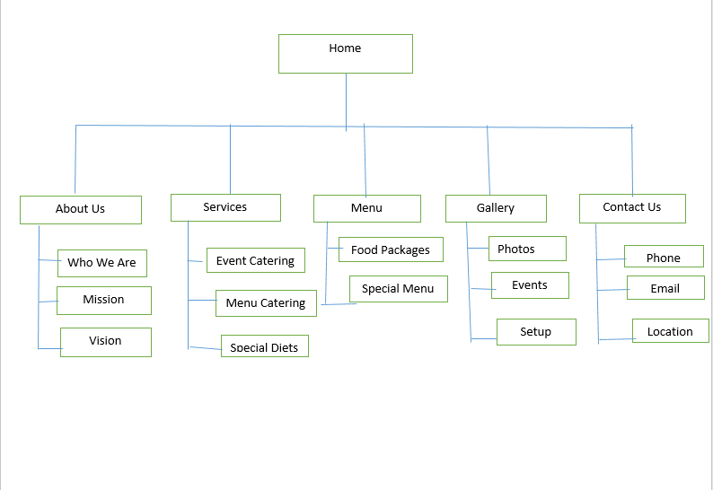

# Project Title
Sessy's Sweet Crumbs

## Student Information
**Student number:** ST10536972
**Student Name:** Mphigalale Rinae Felicity 

## Project Overview
PROJECT OVERVIEW

INTRODUCTION
Sessy’s Crumbs Bakery is a non-profit organisation that uses baking to support underprivileged communities. The organisation provides baked goods to those in need and teaches baking skills to empower youth. This website is designed to promote awareness, encourage community involvement, and support the organisation’s mission.

MISSION
To empower communities through baking by providing skills training, food donations, and outreach programs.

VISION
To become a recognised community-based initiative that improves lives through food support and education.

TARGET AUDIENCE
- Donors who support community upliftment
- Youth interested in learning baking skills
- Volunteers who want to assist in community programs
- Underprivileged communities

WEBSITE FEATURES AND FUNCTIONALITY
The website includes the following pages:
- Home Page: Overview of the organisation
- About Page: Background, mission, and vision
- Menu Page: Bakery products and pricing
- Services Page: Community services and baking activities
- Enquiries Page: Form for volunteer and donation enquiries
- Contact Page: Contact details and message form

The website includes navigation links, forms, and structured content for easy use.

DESIGN AND USER EXPERIENCE
The website is designed to be simple, clear, and easy to navigate. All pages use a consistent layout with a navigation bar. Content is organised using headings and sections to improve readability. The design focuses on accessibility and user-friendly interaction.

TECHNICAL REQUIREMENTS
- HTML for website structure
- CSS for styling (optional improvement)
- Visual Studio Code for development
- GitHub for version control and hosting

BUDGET
- Domain name: R150–R200 per year
- Hosting (GitHub Pages): Free
- Development tools: Free
- Images: Free (from sources like Unsplash and Pexels)

CONCLUSION
The website will help Sessy’s Crumbs Bakery promote its mission, connect with the community, and support its outreach programs through online engagement.

## Website Goals and Objectives
WEBSITE GOALS AND OBJECTIVES

The main goal of the Sessy’s Crumbs Bakery website is to create awareness about the non-profit organisation and support its community initiatives.

Objectives:
- To inform users about the organisation, its mission, and its activities
- To encourage donations from the public
- To recruit volunteers for community programs
- To showcase bakery products and community work
- To provide an easy way for users to contact the organisation

Key Performance Indicators (KPIs):
- Number of enquiries submitted through the website
- Number of volunteers signing up
- Increase in website visitors
- User engagement with different pages
- Number of donation-related enquiries received

## Timeline and Milestones
TIMELINE AND MILESTONES

Week 1:
- Research and proposal development
- Identify target audience and website requirements

Week 2:
- Create project folder and HTML pages
- Build basic website structure

Week 3:
- Add content to all pages (Home, About, Menu, Services, Contact, Enquiries)
- Create navigation links between pages

Week 4:
- Insert forms (contact and enquiries)
- Add images and improve layout

Week 5:
- Apply basic styling (CSS if required)
- Test all pages and fix errors

Week 6:
- Final testing of website functionality
- Upload project to GitHub
- Prepare for submission

## Sitemap

## References

REFERENCES

Feeding South Africa. (2026) Community food support initiatives. Available at: https://www.feedingsa.org (Accessed: 12 April 2026).

Unsplash. (2026) Free images for bakery and community activities. Available at: https://unsplash.com (Accessed: 12 April 2026).

Pexels. (2026) Free images for bakery content. Available at: https://www.pexels.com (Accessed: 12 April 2026).
